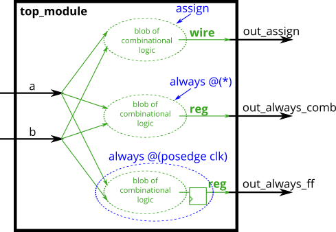

# tutorial-systemverilog

## Lessons

### Basics

1. Build a circuit with no inputs and one output. That output should always drive 1 (or logic high).
2. Build a circuit with no inputs and one output that outputs a constant 0.
3. Create a module with one input and one output that behaves like a wire.
4. Create a module with 3 inputs and 4 outputs that behaves like wires that makes these connections:\
   a -> w\
   b -> x\
   b -> y\
   c -> z
5. Create a module that implements a NOT gate.
6. Create a module that implements an AND gate.
7. Create a module that implements a NOR gate.
8. Create a module that implements an XNOR gate.
9. Implement the following circuit. Create two intermediate wires (named anything you want) to connect the AND and OR
   gates together. Note that the wire that feeds the NOT gate is really wire out, so you do not necessarily need to
   declare a third wire here. Notice how wires are driven by exactly one source (output of a gate), but can feed
   multiple inputs. 
10. Create a module with the same functionality as the 7458 chip. It has 10 inputs and 2 outputs. You may choose to use
    an assign statement to drive each of the output wires, or you may choose to declare (four) wires for use as
    intermediate signals, where each internal wire is driven by the output of one of the AND gates. For extra practice,
    try it both ways. 

### Vectors

1. Build a circuit that has one 3-bit input, then outputs the same vector, and also splits it into three separate 1-bit
   outputs. Connect output o0 to the input vector's position 0, o1 to position 1, etc. In a diagram, a tick mark with a
   number next to it indicates the width of the vector (or "bus"), rather than drawing a separate line for each bit in
   the vector. 
2. Build a combinational circuit that splits an input half-word (16 bits, [15:0] ) into lower [7:0] and upper [15:8]
   bytes.
3. A 32-bit vector can be viewed as containing 4 bytes (bits [31:24], [23:16], etc.). Build a circuit that will reverse
   the byte ordering of the 4-byte word.
   AaaaaaaaBbbbbbbbCcccccccDddddddd => DdddddddCcccccccBbbbbbbbAaaaaaaa
4. Build a circuit that has two 3-bit inputs that computes the bitwise-OR of the two vectors, the logical-OR of the two
   vectors, and the inverse (NOT) of both vectors. Place the inverse of b in the upper half of out_not (i.e.,
   bits [5:3]), and the inverse of a in the lower half. 
5. Build a combinational circuit with four inputs, in[3:0].\
   There are 3 outputs:
    * out_and: output of a 4-input AND gate.
    * out_or: output of a 4-input OR gate.
    * out_xor: output of a 4-input XOR gate.
6. Given several input vectors, concatenate them together then split them up into several output vectors. There are six
   5-bit input vectors: a, b, c, d, e, and f, for a total of 30 bits of input. There are four 8-bit output vectors: w,
   x, y, and z, for 32 bits of output. The output should be a concatenation of the input vectors followed by two 1
   bits.
7. Given an 8-bit input vector [7:0], reverse its bit ordering.
8. One common place to see a replication operator is when sign-extending a smaller number to a larger one, while
   preserving its signed value. This is done by replicating the sign bit (the most significant bit) of the smaller
   number to the left. For example, sign-extending 4'b0101 (5) to 8 bits results in 8'b00000101 (5), while
   sign-extending 4'b1101 (-3) to 8 bits results in 8'b11111101 (-3). \
   Build a circuit that sign-extends an 8-bit number to 32 bits. This requires a concatenation of 24 copies of the sign
   bit (i.e., replicate bit[7] 24 times) followed by the 8-bit number itself.
9. Given five 1-bit signals (a, b, c, d, and e), compute all 25 pairwise one-bit comparisons in the 25-bit output
   vector. The output should be 1 if the two bits being compared are equal. \
   As the diagram shows, this can be done more easily using the replication and concatenation operators.

### Vectors

1. In this exercise, create one instance of module mod_a, then connect the module's three pins (in1, in2, and out) to
   your top-level module's three ports (wires a, b, and out). The module mod_a is provided for you — you must
   instantiate it.
2. You are given a module named mod_a that has 2 outputs and 4 inputs, in that order. You must connect the 6 ports by
   position to your top-level module's ports out1, out2, a, b, c, and d, in that order.
   You are given the following module:\
   module mod_a ( output, output, input, input, input, input );
3. You are given a module named mod_a that has 2 outputs and 4 inputs, in some order. You must connect the 6 ports by
   name to your top-level module's ports:

   | Port in mod_a | Port in top_module |
                                 |---------------|--------------------|
   | output out1   | 	out1              |
   | output out2   | 	out2              |
   | input in1     | 	a                 |
   | input in2     | 	b                 |
   | input in3     | 	c                 |
   | input in4     | 	d                 |
4. You are given a module my_dff with two inputs and one output (that implements a D flip-flop). Instantiate three of
   them, then chain them together to make a shift register of length 3. The clk port needs to be connected to all
   instances. \
   Note that to make the internal connections, you will need to declare some wires. Be careful about naming your wires
   and module instances: the names must be unique.
5. This exercise is an extension of module_shift. Instead of module ports being only single pins, we now have modules
   with vectors as ports, to which you will attach wire vectors instead of plain wires. Like everywhere else in
   Verilog, the vector length of the port does not have to match the wire connecting to it, but this will cause
   zero-padding or truncation of the vector. This exercise does not use connections with mismatched vector lengths.\
   You are given a module my_dff8 with two inputs and one output (that implements a set of 8 D flip-flops). Instantiate
   three of them, then chain them together to make a 8-bit wide shift register of length 3. In addition, create a
   4-to-1 multiplexer (not provided) that chooses what to output depending on sel[1:0]: The value at the input d, after
   the first, after the second, or after the third D flip-flop. (Essentially, sel selects how many cycles to delay the
   input, from zero to three clock cycles.)\
   The module provided to you is: module my_dff8 ( input clk, input [7:0] d, output [7:0] q );
6. You are given a module add16 that performs a 16-bit addition. Instantiate two of them to create a 32-bit adder. One
   add16 module computes the lower 16 bits of the addition result, while the second add16 module computes the upper 16
   bits of the result, after receiving the carry-out from the first adder. Your 32-bit adder does not need to handle
   carry-in (assume 0) or carry-out (ignored), but the internal modules need to in order to function correctly. (In
   other words, the add16 module performs 16-bit a + b + cin, while your module performs 32-bit a + b).\
   Connect the modules together as shown in the diagram below. The provided module add16 has the following
   declaration:\
   module add16 ( input[15:0] a, input[15:0] b, input cin, output[15:0] sum, output cout );
7. In this exercise, you will create a circuit with two levels of hierarchy. Your top_module will instantiate two
   copies of add16 (provided), each of which will instantiate 16 copies of add1 (which you must write). Thus, you must
   write two modules: top_module and add1.\
   Like module_add, you are given a module add16 that performs a 16-bit addition. You must instantiate two of them to
   create a 32-bit adder. One add16 module computes the lower 16 bits of the addition result, while the second add16
   module computes the upper 16 bits of the result. Your 32-bit adder does not need to handle carry-in (assume 0) or
   carry-out (ignored). \
   Connect the add16 modules together as shown in the diagram below. The provided module add16 has the following
   declaration:\
   module add16 ( input[15:0] a, input[15:0] b, input cin, output[15:0] sum, output cout );\
   Within each add16, 16 full adders (module add1, not provided) are instantiated to actually perform the addition. You
   must write the full adder module that has the following declaration:\
   module add1 ( input a, input b, input cin, output sum, output cout );\
   Recall that a full adder computes the sum and carry-out of a+b+cin.\
   In summary, there are three modules in this design:
    * top_module — Your top-level module that contains two of...
    * add16, provided — A 16-bit adder module that is composed of 16 of...
    * add1 — A 1-bit full adder module.
8. One drawback of the ripple carry adder (See previous exercise) is that the delay for an adder to compute the carry
   out (from the carry-in, in the worst case) is fairly slow, and the second-stage adder cannot begin computing its
   carry-out until the first-stage adder has finished. This makes the adder slow. One improvement is a carry-select
   adder, shown below. The first-stage adder is the same as before, but we duplicate the second-stage adder, one
   assuming carry-in=0 and one assuming carry-in=1, then using a fast 2-to-1 multiplexer to select which result
   happened to be correct.\
   In this exercise, you are provided with the same module add16 as the previous exercise, which adds two 16-bit
   numbers with carry-in and produces a carry-out and 16-bit sum. You must instantiate three of these to build the
   carry-select adder, using your own 16-bit 2-to-1 multiplexer.
9. An adder-subtractor can be built from an adder by optionally negating one of the inputs, which is equivalent to
   inverting the input then adding 1. The net result is a circuit that can do two operations: (a + b + 0) and (a + ~b +
   1). See Wikipedia if you want a more detailed explanation of how this circuit works.\
   You are provided with a 16-bit adder module, which you need to instantiate twice:\
   module add16 ( input[15:0] a, input[15:0] b, input cin, output[15:0] sum, output cout );\
   Use a 32-bit wide XOR gate to invert the b input whenever sub is 1. (This can also be viewed as b[31:0] XORed with
   sub replicated 32 times. See replication operator.). Also connect the sub input to the carry-in of the adder.

### Procedures

For hardware synthesis, there are two types of always blocks that are relevant:

    Combinational: always @(*)
    Clocked: always @(posedge clk)

Clocked always blocks create a blob of combinational logic just like combinational always blocks, but also creates a set
of flip-flops (or "registers") at the output of the blob of combinational logic. Instead of the outputs of the blob of
logic being visible immediately, the outputs are visible only immediately after the next (posedge clk).
Blocking vs. Non-Blocking Assignment

There are three types of assignments in Verilog:

    Continuous assignments (assign x = y;). Can only be used when not inside a procedure ("always block").
    Procedural blocking assignment: (x = y;). Can only be used inside a procedure.
    Procedural non-blocking assignment: (x <= y;). Can only be used inside a procedure.

In a combinational always block, use blocking assignments. In a clocked always block, use non-blocking assignments. A
full understanding of why is not particularly useful for hardware design and requires a good understanding of how
Verilog simulators keep track of events. Not following this rule results in extremely hard to find errors that are both
non-deterministic and differ between simulation and synthesized hardware.

1. Build an AND gate using both an assign statement and a combinational always block.
2. Build an XOR gate three ways, using an assign statement, a combinational always block, and a clocked always block.
   Note that the clocked always block produces a different circuit from the other two: There is a flip-flop so the
   output is delayed. 
3. Build a 2-to-1 mux that chooses between a and b. Choose b if both sel_b1 and sel_b2 are true. Otherwise, choose a. Do
   the same twice, once using assign statements and once using a procedural if statement.
4. Fix the bugs so that you will shut off the computer only if it's really overheated, and stop driving if you've
   arrived at your destination or you need to refuel.
5. Case statements are more convenient than if statements if there are a large number of cases. So, in this exercise,
   create a 6-to-1 multiplexer. When sel is between 0 and 5, choose the corresponding data input. Otherwise, output 0.
   The data inputs and outputs are all 4 bits wide.
6. Build a 4-bit priority encoder. For this problem, if none of the input bits are high (i.e., input is zero), output
   zero. Note that a 4-bit number has 16 possible combinations.
7. Build a priority encoder for 8-bit inputs. Given an 8-bit vector, the output should report the first (least
   significant) bit in the vector that is 1. Report zero if the input vector has no bits that are high. For example, the
   input 8'b10010000 should output 3'd4, because bit[4] is first bit that is high.
8. Suppose you're building a circuit to process scancodes from a PS/2 keyboard for a game. Given the last two bytes of
   scancodes received, you need to indicate whether one of the arrow keys on the keyboard have been pressed. This
   involves a fairly simple mapping, which can be implemented as a case statement (or if-elseif) with four cases.

   | Scancode [15:0] | Arrow key   |
                                 |-----------------|-------------|
   | 16'he06b        | left arrow  |
   | 16'he072        | down arrow  |
   | 16'he074        | right arrow |
   | 16'he075        | up arrow    |
   | Anything else   | none        |

   Your circuit has one 16-bit input, and four outputs. Build this circuit that recognizes these four scancodes and
   asserts the correct output.

### More Verilog Features

1. Conditional ternary operator: Given four unsigned numbers, find the minimum. Unsigned numbers can be compared with
   standard comparison operators (a < b). Use the conditional operator to make two-way min circuits, then compose a
   few of them to create a 4-way min circuit. You'll probably want some wire vectors for the intermediate results.
2. Reduction operator: Parity checking is often used as a simple method of detecting errors when transmitting data
   through an imperfect channel. Create a circuit that will compute a parity bit for a 8-bit byte (which will add a 9th
   bit to the byte). We will use "even" parity, where the parity bit is just the XOR of all 8 data bits.
3. Reduction very wide gates: Build a combinational circuit with 100 inputs, in[99:0]. \
   There are 3 outputs:
    * out_and: output of a 100-input AND gate.
    * out_or: output of a 100-input OR gate.
    * out_xor: output of a 100-input XOR gate.
4. For Loop: Given a 100-bit input vector [99:0], reverse its bit ordering.
5. A "population count" circuit counts the number of '1's in an input vector. Build a population count circuit for a
   255-bit input vector.
6. Instance Array: Create a 100-bit binary ripple-carry adder by instantiating 100 full adders. The adder adds two
   100-bit numbers and a carry-in to produce a 100-bit sum and carry out. To encourage you to actually instantiate full
   adders, also output the carry-out from each full adder in the ripple-carry adder. cout[99] is the final carry-out
   from the last full adder, and is the carry-out you usually see.
7. You are provided with a BCD one-digit adder named bcd_fadd that adds two BCD digits and carry-in, and produces a sum
   and carry-out.

         module bcd_fadd (
         input [3:0] a,
         input [3:0] b,
         input cin,
         output cout,
         output [3:0] sum );

   Instantiate 100 copies of bcd_fadd to create a 100-digit BCD ripple-carry adder. Your adder should add two 100-digit
   BCD numbers (packed into 400-bit vectors) and a carry-in to produce a 100-digit sum and carry out. 